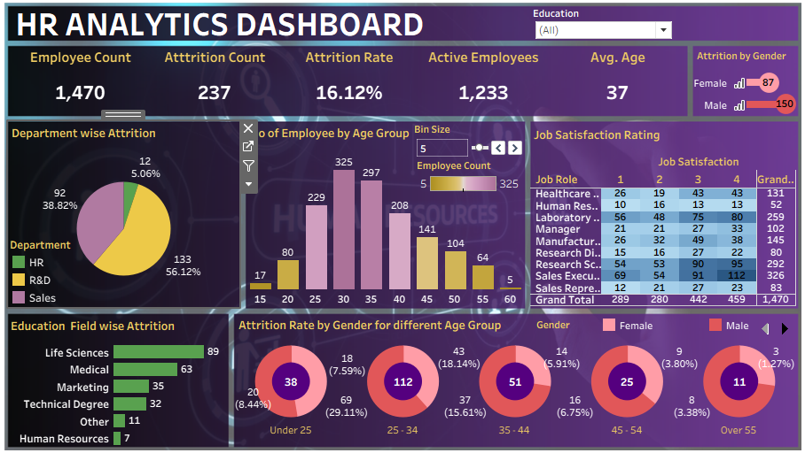

# 📊 HR Analytics Dashboard – Tableau

## 📌 Project Overview

This project is an interactive HR Analytics Dashboard created using Tableau.

The dashboard provides insights into employee data, attrition, departments, age groups, gender, job satisfaction and education fields.

## 🛠️ Tools & Technologies

- Tableau
- Excel 

## 📈 Dashboard Features

- Employee Count
- Attrition Count
- Attrition Rate
- Active Employees
- Average Age

### Dashboard Analysis
- Department-wise Attrition
- Number of Employees by Age Group
- Job Satisfaction Rating by Job Role
- Education Field-wise Attrition
- Attrition by Gender
- Attrition Rate by Gender for Different Age Groups

### Filter
- Education Field Filter

## 🖼️ Dashboard Preview

## 📁 Project Files

- `HR_Analytics_Tableau.twbx` – Tableau packaged workbook
- `HR_Analytics_Tableau.png` – Dashboard preview

## 👩‍💻 Author

**Aishwarya Bodakhe**
